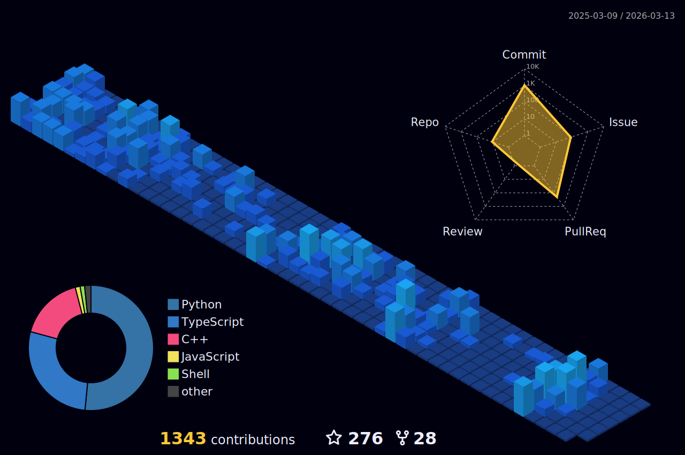

<h1 align="center">
  
</h1>

  

  
  
  
   
   
  
  
  

<h1 align="center"> Working on: </h1>

  
  
  
  

<h1 align="center"> Skills & Tools: </h1>

  
  
  
  
  

   
  
  
  
  
  
  

   

  
  
  
  
  
  

   

  
  
  
  
  

   

  
  
  

   

  
  
  
  

   

  
  
  

<h1 align="center"> Contact me: </h1>

  
  
  

   

